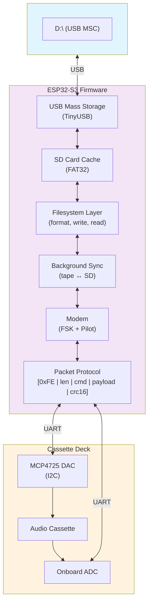
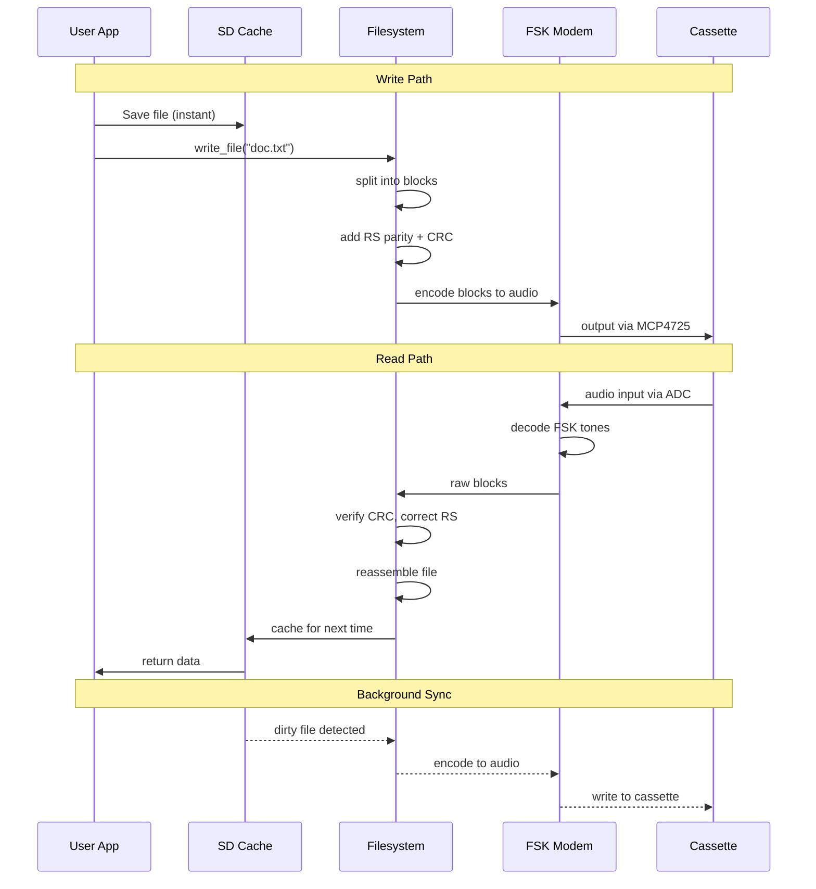

# TapewormFS — Architecture Summary

Concept: store digital files on audio cassette. The ESP32-S3 presents as a
USB flash drive; an SD card provides instant I/O; tape syncs in background.

---

## System Architecture



## Data Flow



## Performance

| Metric | Target |
|--------|--------|
| Raw bit rate | 200 baud |
| Net throughput | ~100 B/s (after FEC) |
| C60 capacity | ~180 KB/side |
| USB interface | 12 Mbps (USB 1.1) |
| SD card speed | ~4 MB/s (SPI) |
| Block read from tape | ~10 s |
| File open (cached) | <10 ms |
| File open (uncached) | 30–60 s |

## Project Layout

```
TapewormFS/
├── filesystem/
│   ├── tapefs.py              ← Python FS lib (for tests)
│   ├── dummy_mcu.py           ← ESP32 simulator (stdio mode)
│   ├── test_tapefs.py         ← Unit tests (6 pass)
│   ├── test_integration.py    ← Integration tests (5 pass)
│   └── cpp/                   ← C++17 production code
│       ├── CMakeLists.txt
│       ├── include/tapefs/    ← Headers (7 files)
│       ├── src/               ← Implementation (6 files)
│       └── tests/             ← C++ unit tests (6 pass)
├── SPEC.md                    ← Full spec
├── OFDM_PHY.md                ← Physical layer spec
├── CPP_STYLE.md               ← C++ style guide
└── debug-suite/               ← Web modem visualiser
```

Run tests:
```bash
cd filesystem
python3 test_tapefs.py         # unit tests
python3 test_integration.py    # integration tests
cd cpp/build && cmake .. && make && ./test_tapefs
```
