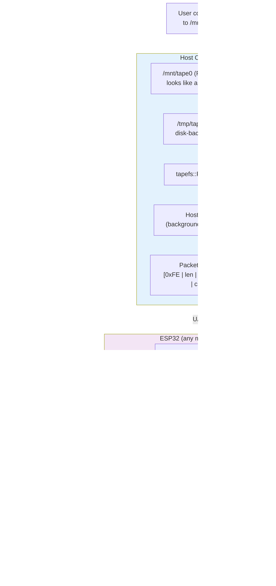
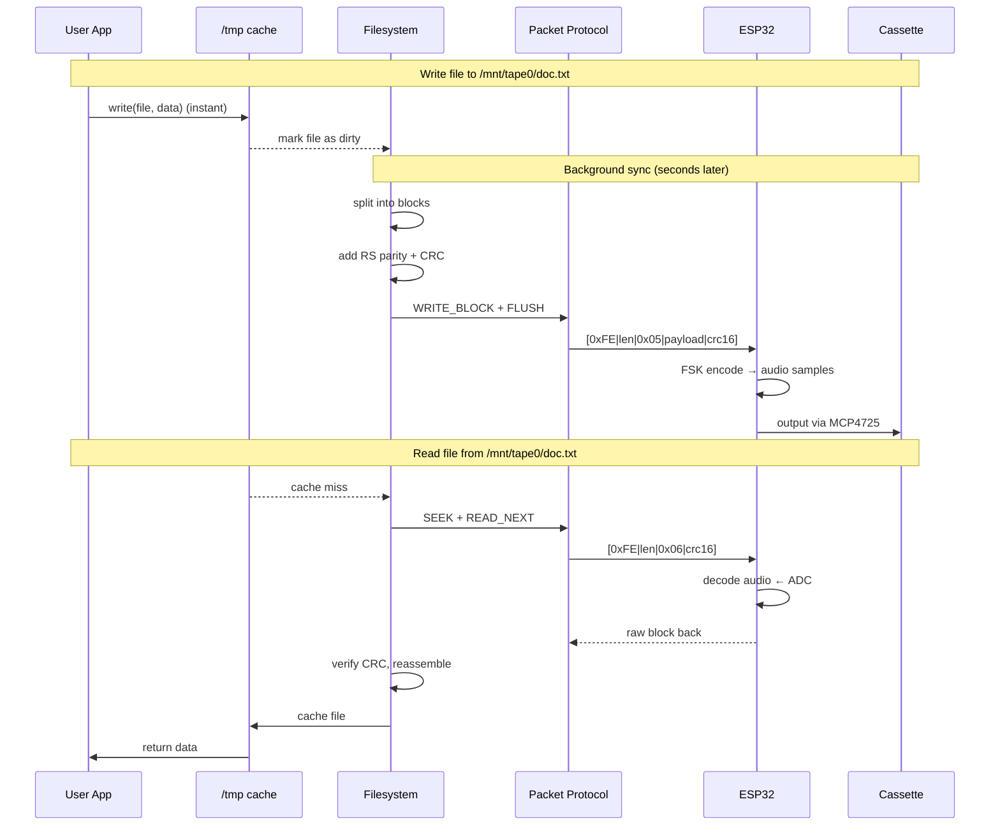

# TapewormFS — Architecture Summary

Store files on audio cassette. The host PC runs a driver that mounts a
folder (e.g. `/mnt/tape`) backed by the cassette. The ESP32 handles only
modem encoding/decoding over UART.

---

## System Architecture



## Data Flow



## Sync Strategy

| Trigger | Action |
|---------|--------|
| User saves file to mount | Write to /tmp cache instantly |
| 10s of no I/O | Start background write to tape |
| User reads uncached file | Read from tape (slow), cache result |
| File already cached | Serve from /tmp instantly |
| Eject / unmount | Force-sync all dirty files to tape |

## Project Layout

```
TapewormFS/
├── filesystem/
│   ├── tapefs.py              ← Python FS lib (for tests)
│   ├── dummy_mcu.py           ← ESP32 simulator
│   ├── host_driver.py         ← Mounts a folder backed by tape
│   ├── test_tapefs.py         ← Unit tests (6 pass)
│   ├── test_integration.py    ← Integration tests (5 pass)
│   └── cpp/                   ← C++17 production code
│       ├── CMakeLists.txt
│       ├── include/tapefs/    ← Headers
│       ├── src/               └── Implementation
│       └── tests/             ← C++ unit tests (6 pass)
├── SPEC.md                    ← Full spec
└── OFDM_PHY.md                ← Physical layer spec
```

Run tests:
```bash
cd filesystem
python3 test_tapefs.py
python3 test_integration.py
cd cpp/build && cmake .. && make && ./test_tapefs
```
