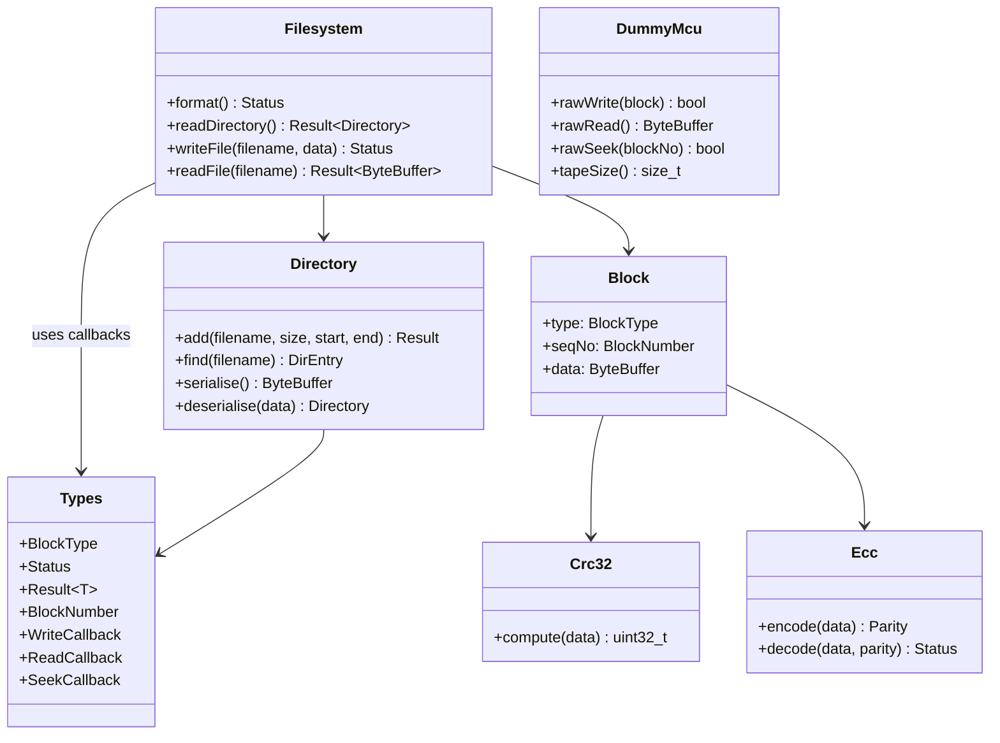

# C++ Code Style Guide for AI — TapewormFS

Rules for generating C++ code that reads like modern TypeScript: clear intent, minimal boilerplate, no C-isms.

---

## 1. Language & Headers

- **C++17** minimum (C++20 preferred where available)
- `#pragma once` for all headers
- Include only what you use

## 2. Naming

| Thing | Style | Example |
|-------|-------|---------|
| Namespace | `snake_case` | `tapeworm::modem` |
| Class / Struct | `PascalCase` | `FskModulator`, `TapePosition` |
| Function | `camelCase` | `sendPacket()`, `readBlock()` |
| Variable | `camelCase` | `sampleRate`, `currentBlock` |
| Constant | `kPascalCase` | `kMaxRetries` |
| Type alias | `PascalCase` | `using Hertz = double;` |

No abbreviations except universally understood (`cfg` for config, `cb` for callback).

## 3. Types

- Strong aliases: `using BlockNumber = uint32_t;`
- `std::optional<T>` for fallible returns
- `std::vector`, `std::array`, `std::string_view` — no raw arrays or C-strings
- No `void*` — use templates or `std::any`
- No `#define` for constants — use `constexpr`

## 4. Classes

- One class per file
- Public section first (constructor, methods), then private
- RAII: acquire in constructor, release in destructor — no `init()`/`close()` methods
- Composition over inheritance
- Callbacks as `std::function`:
```cpp
class AudioStream {
public:
    using SampleCallback = std::function<void(float)>;
    void start(SampleCallback onSample);
};
```

## 5. Construction with Config structs

```cpp
struct ModemConfig {
    int sampleRate = 3200;
    std::vector<float> frequencies = {400, 600, 800};
};

class Modem {
public:
    explicit Modem(ModemConfig cfg);
};

// Usage:
Modem m({.sampleRate = 44100, .frequencies = {400, 800, 1200}});
```

## 6. Error handling

No error codes. Use `std::optional` or a simple `Result<T>`:

```cpp
struct Status { bool ok; std::string message; };

template<typename T>
struct Result {
    Status status;
    T value;
};
```

Usage:
```cpp
if (auto result = readBlock()) {
    process(result->value);
} else {
    log(result->status.message);
}
```

## 7. Event-driven architecture

```cpp
class EventBus {
public:
    void emit(std::string_view event, const void* data = nullptr);
    void on(std::string_view event, std::function<void(const void*)> handler);
};
```

No raw function pointers. No polling loops.

## 8. Formatting

- 4 spaces, no tabs
- Opening brace on same line
- Short functions preferred (<30 lines)
- Range-based for: `for (const auto& item : container)`
- No raw `new`/`delete` — stack allocate or use smart pointers

## 9. Documentation

- Variable names over comments (the code should explain itself)
- Comments explain *why*, not *what*
- One-line header comment per class describing responsibility

## 10. Embedded (ESP32) specifics

- STL okay where the platform supports it (`<vector>`, `<functional>`, `<array>`)
- Wrap hardware in RAII classes (I2S, SPI, GPIO)
- FreeRTOS tasks abstracted behind a `Task` class taking `std::function`

## 11. TapewormFS project patterns



---

*By following these rules, generated C++ should be as readable as modern TypeScript — the type system and structure make the logic obvious without cryptic syntax.*
