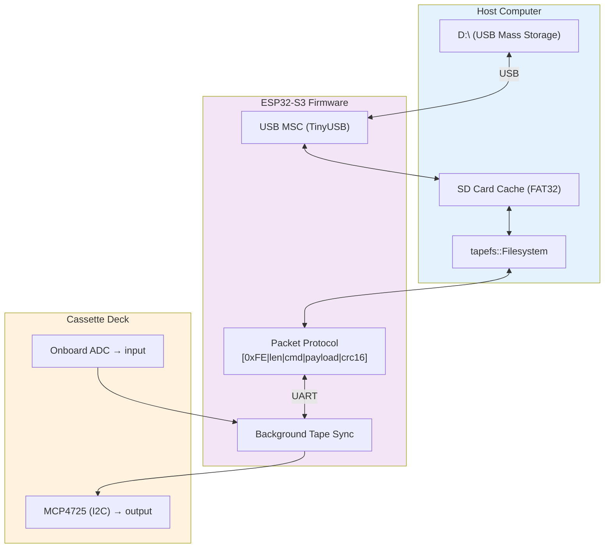

# TapewormFS

Store digital files on audio cassette tapes.



## Project layout

| Path | What |
|------|------|
| `filesystem/cpp/` | C++17 production code (6 classes, 6 tests) |
| `filesystem/tapefs.py` | Python FS lib (for tests) |
| `filesystem/dummy_mcu.py` | ESP32 simulator with tape physics |
| `filesystem/test_tapefs.py` | Unit tests (6 pass) |
| `filesystem/test_integration.py` | Serial integration tests (5 pass) |
| `debug-suite/` | Web modem visualiser (TypeScript) |
| `SPEC.md` | Full protocol & filesystem spec |
| `OFDM_PHY.md` | Physical layer spec (FSK+pilot) |
| `ARCHITECTURE.md` | System architecture |

## Build & test

```bash
# C++ (production)
cd filesystem/cpp && mkdir build && cd build
cmake .. && make && ./test_tapefs

# Python (tests)
cd filesystem
python3 test_tapefs.py
python3 test_integration.py
```
