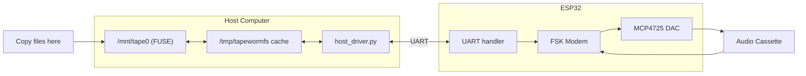

# TapewormFS

Store files on audio cassette. Mount a folder, copy files — the driver
handles everything: caching, sync, the UART protocol to the ESP32 modem.

## Quick start

```bash
# List files on tape (over UART)
python3 host_driver.py ls --port /dev/ttyUSB0

# Mount tape as a folder (FUSE)
pip install fusepy
python3 host_driver.py mount ./tape_mount --port /dev/ttyUSB0

# Sync a local folder to/from tape
python3 host_driver.py sync ./my_backup --port /dev/ttyUSB0

# Format tape
python3 host_driver.py format --port /dev/ttyUSB0

# Without hardware: test with DummyMCU
python3 host_driver.py ls --port stdio    # reads from stdin
```

## Architecture



The ESP32 has no filesystem, no SD card, no USB mass storage.
It just encodes/decodes audio frames over serial. The host does
all the heavy lifting: filesystem, caching, presenting as a drive.

## Project

| Path | What |
|------|------|
| `host_driver.py` | Mounts a folder backed by tape |
| `tapefs.py` | Filesystem library (CRC, RS ECC, Directory, Block) |
| `dummy_mcu.py` | ESP32 simulator for testing |
| `cpp/` | C++17 implementation of the same filesystem |

## Tests

```bash
cd filesystem
python3 test_tapefs.py         # 6 unit tests
python3 test_integration.py    # 5 integration tests
cd cpp/build && cmake .. && make && ./test_tapefs   # 6 C++ tests
```
