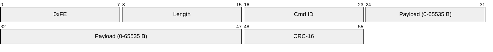
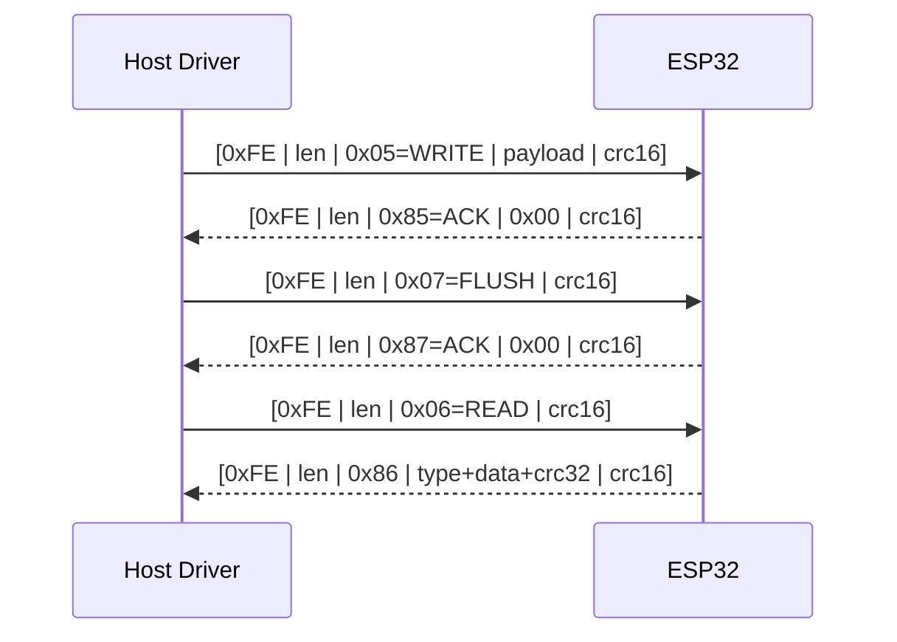
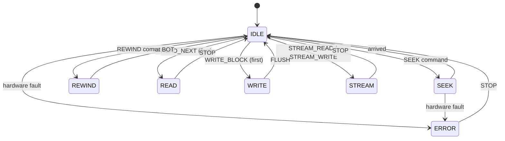
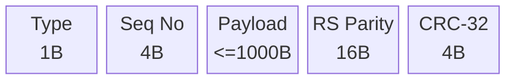

# TapewormFS — Specification

Store digital files on standard audio cassette tapes.

---

## 1. Architecture Overview

```
┌─────────────────────────────────────────────────────────┐
│                      HOST COMPUTER                       │
│                                                          │
│  /mnt/tape0/  ──▶  /tmp/tapewormfs/  ──▶  host_driver  │
│  (FUSE mount)      (disk cache)         (sync thread)   │
│                                                          │
│  ┌──────────┐    ┌──────────────┐    ┌───────────────┐  │
│  │  FUSE    │◀──▶│  tapefs FS   │◀──▶│  Packet Proto │  │
│  │  (OS)    │    │  (CRC+RS)    │    │  [0xFE|len|..]│  │
│  └──────────┘    └──────────────┘    └───────┬───────┘  │
│                                                │ UART    │
└────────────────────────────────────────────────┼─────────┘
                                                 │
                                          ┌──────┴───────┐
                                          │   ESP32       │
                                          │  (any model)  │
                                          │  UART handler │
                                          │  FSK Modem    │
                                          │  MCP4725 DAC  │
                                          │  Onboard ADC  │
                                          └──────┬───────┘
                                                 │ I2C / analog
                                          ┌──────┴───────┐
                                          │ Cassette     │
                                          │ Deck         │
                                          └──────────────┘
```

### 1.1 Components

| Layer | Tech | Role |
|-------|------|------|
| **host-driver** | Python (FUSE) | Mounts a folder backed by tape, manages cache |
| **tapefs** | Python / C++ | Filesystem library: CRC, RS ECC, Directory, Block |
| **firmware** | C / ESP-IDF | Bit-level encode/decode: I2C (MCP4725) for output, onboard ADC for input |
| **packet protocol** | Binary | Framed packets over UART |


---

## 2. Data Flow

### 2.1 Write Path

```
User file  →  host-driver  →  /tmp buffer  →  filesystem layer
      ↓
  blocks with ECC
      ↓
  modem encode (FreqShift / Basic)
      ↓
  firmware → I2C (MCP4725) → cassette LINE IN
```

### 2.2 Read Path

```
Cassette LINE OUT → firmware (I2S ADC) → modem decode
      ↓
  raw blocks with error flags
      ↓
  filesystem layer → ECC recovery → reassemble
      ↓
  /tmp buffer → host-driver → OS
```

### 2.3 Packet Protocol (wire format)





---

## 3. Transport Protocol (MCU ↔ Host)

### 3.1 Physical Layer

| Connection | Speed | Notes |
|------------|-------|-------|
| USB CDC (serial) | 115200–921600 baud | Primary debug/production link |
| SPI | 1–10 MHz | Direct MCU↔MCU, or MCU↔SBC |

Both layers carry the same packet format (§3.2). The protocol is symmetric — either side may initiate a command.

### 3.2 Packet Format (binary, little-endian)

```
┌────┬──────┬────────┬──────────┬──────────┐
│0xFE│ len  │ cmd_id │ payload  │ checksum │
│ 1B │ 2B   │ 1B     │ 0-65535B │ CRC-16   │
└────┴──────┴────────┴──────────┴──────────┘
```

| Field | Size | Description |
|-------|------|-------------|
| **Start marker** | 1 B | Always `0xFE`. Receiver resets framing on any other byte. |
| **Length** | 2 B | Number of bytes **after** the length field (cmd_id + payload + checksum). Max 65535. |
| **Command ID** | 1 B | Bit 7 = 0 for requests (0x00–0x7F), 1 for responses (0x80–0xFF). |
| **Payload** | 0–65532 B | Command-specific, see §3.5. |
| **Checksum** | 2 B | CRC-16-IBM (`0x8005`, init `0x0000`) over everything from `len` to end of payload. |

**Framing rule:** If a byte `0xFE` appears inside payload or checksum, it is escaped to `0xFD 0x01`. The byte `0xFD` is escaped to `0xFD 0x02`. The receiver unescapes before parsing.

**Response convention:** Response ID = Request ID | `0x80`. Every request gets exactly one response (ACK/NAK). NAK carries a 1-byte error code.

### 3.3 MCU State Machine



The MCU runs a deterministic state machine. Certain commands are only valid in certain states.

```
        ┌──────────┐
        │  IDLE    │◀─────────────────────────┐
        └────┬─────┘                          │
             │                                │
      ┌──────┼──────┐                          │
      │             │                          │
      ▼             ▼                          │
  ┌────────┐  ┌──────────┐                    │
  │ SEEK   │  │ REWIND   │                    │
  └───┬────┘  └────┬─────┘                    │
      │             │                          │
      ▼             ▼                          │
  ┌────────┐  ┌──────────┐                    │
  │ READ   │  │ WRITE    │                    │
  └───┬────┘  └────┬─────┘                    │
      │             │                          │
      └──────┬──────┘                          │
             │   ▲                             │
             ▼   │                             │
        ┌────────┐       ┌─────────┐           │
        │ STREAM │──────▶│  ERROR  │───────────┘
        └────────┘       └─────────┘   (reset  │
             │                 │         via    │
             └─────────────────┘────── STOP)   │
                                                │
        Any state ──── STOP ────────────────────┘
```

| State | Valid Commands | Behaviour |
|-------|----------------|-----------|
| **IDLE** | PING, GET_STATUS, SEEK, REWIND, WRITE_BLOCK, READ_NEXT, STOP | Motor off. MCU waits. |
| **SEEK** | STOP, GET_STATUS | Motor on, fast-forwarding/rewinding to target position. Auto-transitions to IDLE on arrival. |
| **REWIND** | STOP, GET_STATUS | Motor on, rewinding to BOT. Auto-transitions to IDLE. |
| **READ** | STOP, GET_STATUS, READ_NEXT | Motor on, actively decoding audio → parsing blocks. |
| **WRITE** | STOP, GET_STATUS, WRITE_BLOCK, FLUSH | Motor on, encoding blocks → outputting audio. |
| **STREAM** | STOP, GET_STATUS | High-speed bulk transfer (fast-forward read). |
| **ERROR** | STOP, GET_STATUS | Error condition. Only STOP can clear it back to IDLE. |

### 3.4 Tape Position Struct

The MCU maintains a position context exposed via `GET_STATUS` and settable via `SEEK`.

```c
// Both host and MCU share this layout
struct __attribute__((packed)) TapePosition {
    uint32_t block_number;   // Estimated block number at current head position
    uint32_t byte_offset;    // Byte offset within current block (0 = at block boundary)
    uint32_t tape_ms;        // Milliseconds from BOT (derived from motor run time)
    uint8_t  side;           // 0 = side A, 1 = side B
    uint8_t  confidence;     // Position confidence: 0 = guessed, 255 = exact (sync found)
};
// Total: 14 bytes
```

**How position is tracked:**
- On **write**, the MCU knows exactly where each block lands (block_number increments per write).
- On **read**, position is updated every time a sync preamble is decoded.
- On **rewind/seek**, position is estimated from motor run time until a sync marker is found, then locked.
- `tape_ms` allows the host to estimate ETA for operations.

### 3.5 Command Reference

#### 3.5.1 Host → MCU Commands

#### `0x01` — PING

| | |
|---|---|
| Payload | *(empty)* |
| Response | `0x81` + firmware version string (null-terminated, max 32 B) |
| Valid states | IDLE, ERROR |

Probes whether the MCU is alive. No side effects.

#### `0x02` — GET_STATUS

| | |
|---|---|
| Payload | *(empty)* |
| Response | `0x82` + `TapePosition` (14 B) + status flags (2 B) + buffer level (1 B) |
| Valid states | All |

**Status flags (16-bit bitmask):**

| Bit | Name | Meaning |
|-----|------|---------|
| 0 | `TAPE_PRESENT` | Cassette detected in deck |
| 1 | `TAPE_MOVING` | Motor engaged |
| 2 | `WRITE_PROTECT` | Tab broken |
| 3 | `STATE_BUSY` | MCU is in a non-IDLE state |
| 4 | `BUFFER_EMPTY` | TX buffer empty (no data waiting to write) |
| 5 | `BUFFER_FULL` | RX buffer at capacity (host must consume) |
| 6 | `ERROR_FLAG` | Error condition active |
| 7 | `EOT` | End of tape detected (physical leader sensed) |
| 8 | `BOT` | Beginning of tape (rewind complete) |
| 9 | `POSITION_LOCKED` | Sync found, position is exact |
| 10 | `CRC_MISMATCH` | Last block had CRC error |
| 11 | `OVERRUN` | MCU couldn't keep up with real-time I/O |
| 12–15 | *(reserved)* | Zero |

**Buffer level:** 0–255, indicating MCU internal buffer fill %.

#### `0x03` — SEEK

| | |
|---|---|
| Payload | Target `TapePosition` (14 B). Set fields to zero for "don't care". At minimum, `block_number` should be set. |
| Response | `0x83` + ACK (0x00) or NAK (error code) |
| Valid states | IDLE, READ, WRITE, STREAM |
| State transition | → SEEK (if motor needed), back to IDLE when complete. If already in READ/WRITE, operation is aborted. |

Host tells MCU where to position the tape head. MCU will fast-forward or rewind as needed, listening for sync markers to lock position.

**Response timing:** Immediate ACK means seek has started (non-blocking). Host polls `GET_STATUS` to detect arrival (`STATE_BUSY` → 0, `POSITION_LOCKED` = 1).

#### `0x04` — REWIND

| | |
|---|---|
| Payload | *(empty)* |
| Response | `0x84` + ACK (0x00) or NAK |
| Valid states | IDLE, READ, WRITE |
| State transition | → REWIND → IDLE |

Rewinds to BOT. Non-blocking — poll `GET_STATUS` for completion (`BOT` flag + `STATE_BUSY` = 0).

#### `0x05` — WRITE_BLOCK

| | |
|---|---|
| Payload | Block type (1 B) + block data (≤1024 B) |
| Response | `0x85` + ACK (0x00) or NAK (error code) |
| Valid states | IDLE, WRITE |
| State transition | IDLE → WRITE (first call). Stays in WRITE. |

Transmits one block to the MCU for encoding onto tape. The MCU buffers it internally. If its buffer is full, it responds NAK + `BUFFER_FULL` and the host must retry later.

**Block type byte:** same as §5.1 prefix (`0x01` data, `0x02` directory, `0x03` FAT, `0xFF` EOT).

**ACK means** the block was accepted into MCU buffer, **not** that it has been written to tape yet.

#### `0x06` — READ_NEXT

| | |
|---|---|
| Payload | *(empty)* |
| Response | `0x86` + block type (1 B) + block data (≤1024 B) + CRC-32 of block data (4 B), OR `0x86` + NAK if no block available |
| Valid states | IDLE, READ |
| State transition | IDLE → READ (first call). Stays in READ. |

Requests the next block from tape. MCU starts decoding audio, finds the next sync preamble, reads a block, and returns it.

**Blocking call:** Response may take several seconds (inter-block gap + decode time). Host should set a generous timeout.

**NAK means:** end of tape reached (`EOT` flag) or unrecoverable read error.

#### `0x07` — FLUSH

| | |
|---|---|
| Payload | *(empty)* |
| Response | `0x87` + ACK when all buffered blocks have been written to tape |
| Valid states | WRITE |
| State transition | Stays in WRITE, then → IDLE when done. |

Blocks until the MCU's internal write buffer is fully drained to tape. Used before STOP to ensure no data loss.

#### `0x08` — STOP

| | |
|---|---|
| Payload | *(empty)* |
| Response | `0x88` + ACK |
| Valid states | All |
| State transition | Any → IDLE (or ERROR → IDLE) |

Immediately halts all tape motion, disengages motor. Any buffered but unwritten data is **lost** (host should send FLUSH first).

#### `0x09` — SET_CONFIG

| | |
|---|---|
| Payload | Config key (1 B) + value (variable) |
| Response | `0x89` + ACK or NAK |
| Valid states | IDLE |
| State transition | stays IDLE |

**Config keys:**

| Key | Value | Default | Description |
|-----|-------|---------|-------------|
| `0x01` | baud_rate (4B, uint32) | 200 | Raw bit rate for modem |
| `0x02` | modulation (1B) | 0 = Basic | 0=Basic, 1=FrequencyPulse |
| `0x03` | frame_size (2B, uint16) | 1024 | Modem frame size in samples |
| `0x04` | volume (1B, uint8) | 128 | Output volume 0–255 |
| `0x05` | agc_target (1B, uint8) | 128 | AGC target level 0–255 |

#### `0x0A` — STREAM_READ

| | |
|---|---|
| Payload | Block count to stream (2B, uint16). 0 = until EOT. |
| Response | `0x8A` + ACK (stream started) |
| Valid states | IDLE |
| State transition | → STREAM |

Enters streaming read mode. MCU reads blocks continuously and sends them as **unsolicited** `EVT_BLOCK` packets (see §3.6). Host consumes them as they arrive. Send STOP to end streaming.

#### `0x0B` — STREAM_WRITE

| | |
|---|---|
| Payload | *(empty)* |
| Response | `0x8B` + ACK |
| Valid states | IDLE |
| State transition | → STREAM |

Enters streaming write mode. Host sends continuous `WRITE_BLOCK` commands. MCU does not return to IDLE between blocks. Send FLUSH then STOP to finish.

### 3.6 MCU → Host Events (Unsolicited)

The MCU may send packets without a matching host request. These use command IDs in the response range (`0x80+`) but are spontaneous.

| ID | Name | Payload | When |
|----|------|---------|------|
| `0xC0` | `EVT_STATUS_CHANGE` | New status flags (2 B) + `TapePosition` (14 B) | State machine transition, error, EOT/BOT detection. Replaces polling. |
| `0xC1` | `EVT_BLOCK_READ` | Block type (1 B) + block data (≤1024 B) + CRC-32 (4 B) | In STREAM mode, each decoded block is pushed to host |
| `0xC2` | `EVT_READ_ERROR` | Block number (4 B) + error code (1 B) | Block failed after all retries |
| `0xC3` | `EVT_PROGRESS` | Progress % (1 B) + ETA seconds (2 B) | During long operations (rewind, seek, stream) |
| `0xC4` | `EVT_BLOCK_WRITTEN` | Block number (4 B) | Confirmation that a buffered block has actually been written to tape |

### 3.7 Error Codes

Returned as 1-byte payload in NAK responses.

| Code | Name | Meaning |
|------|------|---------|
| `0x01` | `ERR_UNKNOWN_CMD` | Command ID not recognised |
| `0x02` | `ERR_INVALID_STATE` | Command not valid in current MCU state |
| `0x03` | `ERR_CHECKSUM` | Packet checksum mismatch |
| `0x04` | `ERR_INVALID_PARAM` | Payload malformed or out of range |
| `0x05` | `ERR_BUFFER_FULL` | MCU buffer full, retry later |
| `0x06` | `ERR_TIMEOUT` | Operation timed out (e.g. sync not found) |
| `0x07` | `ERR_NO_TAPE` | No cassette in deck |
| `0x08` | `ERR_WRITE_PROTECT` | Write-protect tab detected |
| `0x09` | `ERR_BLOCK_CRC` | Block CRC mismatch after read |
| `0x0A` | `ERR_ECC_FAILED` | Reed-Solomon could not correct errors |
| `0x0B` | `ERR_HW_FAULT` | Hardware error (DAC/ADC/spindle fault) |

### 3.8 Example Dialogues

#### Write a file (3 blocks)

```
HOST                            MCU
  │                               │
  ├── PING ──────────────────────▶│
  │◀── PONG (fw v1.0) ───────────┤
  │                               │
  ├── GET_STATUS ────────────────▶│
  │◀── STATUS (IDLE, tape OK) ───┤
  │                               │
  ├── WRITE_BLOCK(type=DATA) ────▶│  ← IDLE→WRITE
  │◀── ACK ──────────────────────┤      (buffered)
  ├── WRITE_BLOCK(type=DATA) ────▶│
  │◀── ACK ──────────────────────┤
  ├── WRITE_BLOCK(type=DATA) ────▶│
  │◀── ACK ──────────────────────┤
  ├── FLUSH ─────────────────────▶│
  │     ... MCU encodes to tape ...  │
  │◀── ACK ──────────────────────┤  ← WRITE→IDLE
  ├── STOP ──────────────────────▶│
  │◀── ACK ──────────────────────┤
```

#### Read 2 blocks

```
HOST                            MCU
  │                               │
  ├── REWIND ───────────────────▶│  ← IDLE→REWIND
  │◀── ACK ──────────────────────┤      (non-blocking)
  │     ... MCU rewinds ...         │
  │◀── EVT_STATUS_CHANGE ────────┤  ← REWIND→IDLE, BOT
  │                               │
  ├── READ_NEXT ────────────────▶│  ← IDLE→READ
  │     ... MCU finds sync, decodes ... │
  │◀── BLOCK(type=DIR) ──────────┤  (directory block)
  ├── READ_NEXT ────────────────▶│
  │     ... seeks to block 5 ...    │
  │◀── BLOCK(type=DATA, seq=5) ──┤
  ├── STOP ──────────────────────▶│  ← READ→IDLE
  │◀── ACK ──────────────────────┤
```

#### Streaming read with continuous events

```
HOST                            MCU
  │                               │
  ├── STREAM_READ(count=0) ──────▶│  ← IDLE→STREAM
  │◀── ACK ──────────────────────┤
  │     ... MCU reads ...           │
  │◀── EVT_BLOCK_READ(seq=1) ────┤
  │◀── EVT_PROGRESS(12%, 300s) ──┤
  │◀── EVT_BLOCK_READ(seq=2) ────┤
  │◀── EVT_BLOCK_READ(seq=3) ────┤
  │◀── EVT_PROGRESS(25%, 240s) ──┤
  │     ...                        │
  ├── STOP ──────────────────────▶│  ← STREAM→IDLE
  │◀── ACK ──────────────────────┤
```

### 3.9 Timing & Timeouts

| Parameter | Value | Notes |
|-----------|-------|-------|
| Host ACK timeout | 5 s | How long host waits for ACK after sending a command |
| Host data timeout | 120 s | How long host waits for a BLOCK response (read) |
| MCU inter-byte timeout | 100 ms | Gaps >100 ms = packet aborted, re-sync |
| Status push interval | 1 s | MCU sends `EVT_STATUS_CHANGE` at most once per second |
| Progress push interval | 5 s | MCU sends `EVT_PROGRESS` at most once per 5 seconds |

---

## 4. Physical Cassette Encoding

### 4.1 Audio Modulation (Modem Layer)

| Scheme | Bit rate | Notes |
|--------|----------|-------|
| **Basic** (BPSK-like) | ~100–300 baud | Simple carrier phase shift |
| **FrequencyPulse** (FSK) | ~50–200 baud | Multi-tone FSK, more robust |

Both defined in `debug-suite/src/core/processors/`.

### 4.2 Cassette Tape Layout

```mermaid
block-beta
columns 5
    Leader["Leader<br/>5s"] Sync["Sync<br/>512B"] Block1["Block 1<br/><=1KB"] Block2["Block 2<br/><=1KB"] Trailer["Trailer<br/>5s"]
    space
    Columns 2
    Gap["Inter-block gap<br/>>=500ms"]
end
```

- **Leader:** Unmodulated carrier / silence for AGC stabilisation
- **Sync:** Fixed preamble (`0xFE 0xED 0xBE 0xEF` repeated) for block alignment
- **Blocks:** See §5
- **Trailer:** End-of-tape marker + silence

### 4.3 Inter-Block Gap

≥ 500 ms of silence between blocks to allow the cassette deck's AGC to reset and the MCU to process.

### 4.4 MCP4725 DAC Hardware Reference

| Pin | Label | Connect To |
|-----|-------|------------|
| 1 | VOUT | 3.5 mm jack centre → cassette LINE IN |
| 2 | GND | GND (also to jack sleeve) |
| 3 | VDD | 3.3 V |
| 4 | SDA | MCU I2C data (GPIO 21 on ESP32, GPIO 4 on Pico) |
| 5 | SCL | MCU I2C clock (GPIO 22 on ESP32, GPIO 5 on Pico) |
| 6 | A0 | GND (address 0x60) or 3.3 V (address 0x61) |

**Audio output:** MCP4725 VOUT → 3.5 mm jack tip → cassette deck LINE IN. GND to sleeve.

**I2C config:**
- Address: `0x60` (A0=GND) or `0x61` (A0=3.3V)
- 12-bit DAC value: 0–4095
- Write format: `0x40` (write DAC register) + value_hi (4-bit) + value_lo (8-bit)
- Max I2C speed: 400 kHz (fast mode). At 400 kHz, ~30k updates/s achievable
- No hardware sample clock — MCU timer ISR drives updates
- Output buffer: MCP4725 has no FIFO — each sample must be written individually over I2C

**Sample rate limit:**

| I2C Speed | Theoretical max | Practical (with overhead) |
|-----------|----------------|---------------------------|
| 100 kHz (std) | ~8 kHz | ~5 kHz usable |
| 400 kHz (fast) | ~28 kHz | ~18 kHz usable |

For a 200 baud modem with 1024 samples/frame, sample rate of ~8 kHz is sufficient → std I2C is fine.

**Output conditioning:** Place a 10 µF electrolytic + 100 nF ceramic capacitor between VOUT and GND to smooth the DAC output. A 1 kΩ resistor in series with the output limits current to the cassette deck's LINE IN.

**ADC for read-back (on-board MCU ADC):** Cassette LINE OUT → voltage divider → MCU ADC pin.

The MCU's built-in ADC is used for audio capture. No external ADC chip required.

| MCU | ADC Resolution | Usable Sample Rate | Notes |
|-----|---------------|-------------------|-------|
| **ESP32** | 12-bit (0–4095) | ~6–10 kHz | 2 ADCs, multiplexed across up to 18 pins. Attenuation set via `analogSetAttenuation()`. Non-linear near 0/Vref — use middle range. |
| **RP2040** | 12-bit (0–4095) | ~500 kHz (single) / ~48 kHz (with DMA) | 4 inputs, 1 SAR ADC + mux. Much faster than ESP32 with proper DMA setup. |

**Input conditioning circuit:**

```
Cassette LINE OUT  ──┬── 1µF DC-block ──┬── 10k┐── MCU ADC pin
                     │                  │      │
                    GND               GND    10k
                                              │
                                             GND
```

- **1 µF capacitor:** Blocks DC offset from cassette deck (typically 0.5–2 V)
- **10 kΩ pulldown:** Biases the ADC input to GND after DC block
- **Optional 10 kΩ to GND:** Forms a voltage divider for hot cassette outputs (>3.3 V peak). Omit if cassette output is ≤3.3 V.
- **3.3 V zener diode** (optional): Clamp protection across ADC pin to GND.

**ESP32 specific notes:**
- Use `analogSetAttenuation(ADC_11db)` to widen input range to ~0–3.3 V
- ADC2 is used by WiFi — use ADC1 for reliable capture
- Two consecutive reads and discard the first to stabilise the sample
- Built-in ADC is noisy (±2–3% jitter). For 200 baud / 1024-sample frames, this is manageable — the modem decoder already expects noise

---

## 5. Filesystem Format

### 5.1 Block Structure



Each physical block on tape (≤1024 bytes after modem encode):

| Field | Size | Description |
|-------|------|-------------|
| Type | 1 B | Block type (0x01=data, 0x02=dir, 0x03=FAT, 0xFF=EOT) |
| Seq No | 4 B | Sequential block number (little-endian) |
| Payload | ≤1000 B | File data or directory entries |
| RS Parity | 16 B | Reed-Solomon RS(255,239) parity |
| CRC-32 | 4 B | Integrity check over everything above |

### 5.2 Directory

Stored as a single block near start of tape (rewound to find).

```
┌──────────┬────────────┬─────────────┬────────────┐
│  magic   │  file_1     │  file_2      │  ...       │
│  "TWF"   │  entry      │  entry       │            │
│  (3B)    │  (32B each) │  (32B each)  │            │
└──────────┴────────────┴─────────────┴────────────┘
```

Each file entry (32 bytes):

| Offset | Size | Field |
|--------|------|-------|
| 0 | 20 | Filename (null-padded ASCII) |
| 20 | 4 | Start block number |
| 24 | 4 | End block number |
| 28 | 4 | File size in bytes |

### 5.3 Error Recovery Strategy

Because audio cassette is _very_ error-prone:

1. **Every block has Reed-Solomon ECC** — corrects up to 8 byte errors per block
2. **Block-level interleaving** — consecutive blocks are not adjacent on tape (spread over ~10s of tape to handle dropouts)
3. **Redundant FAT** — two copies of directory/FAT at start of tape
4. **Read retries** — MCU re-reads failed blocks up to 3 times with different AGC settings
5. **Partial reads** — filesystem can return what it got + bitmap of lost blocks

---

## 6. /tmp Buffer (Host-Driver)

Since cassette I/O is far slower than disk, the host-driver maintains a disk-backed buffer:

### 6.1 Write Buffer

```
User writes file
    ↓
host-driver stores in /tmp/tapewormfs/<session>/write_buf/
    ↓
Background thread encodes blocks and sends to MCU
    ↓
On success, blocks are freed from buffer
```

### 6.2 Read Buffer

```
User requests file
    ↓
host-driver checks /tmp/tapewormfs/<session>/read_buf/
    ↓
If not cached: signals MCU to start reading tape
    ↓
Blocks arrive slowly, appended to read_buf/
    ↓
OS sees a sequential stream that blocks on read()
```

### 6.3 Session Management

Each tape load/eject gets a new session ID:

```
/tmp/tapewormfs/
├── 2026-06-25_104518/
│   ├── write_buf/
│   ├── read_buf/
│   └── manifest.json
└── current -> 2026-06-25_104518  (symlink)
```

---

## 7. Host-Driver OS Integration

### 7.1 FUSE Implementation

Presents as mount point e.g. `/mnt/tape0`.

| Operation | Behaviour |
|-----------|-----------|
| `open("/mnt/tape0/myfile.wav")` | Looks up in tape directory, starts streaming read |
| `read(fd, buf, n)` | Returns buffered data; blocks if buffer empty (MCU still reading) |
| `write(fd, buf, n)` | Appends to write buffer; returns immediately |
| `close(fd)` | Flushes write buffer, starts encode+write to tape |
| `readdir("/mnt/tape0")` | Reads directory block from tape |
| `stat("/mnt/tape0")` | Returns tape metadata (capacity, blocks free) |

### 7.2 Non-FUSE Fallback

A simple TCP server (port 9725) that speaks a text protocol for systems that can't run FUSE:

```
> LIST
< file1.txt 1024 3
< file2.bin 8192 24
> READ file1.txt
< 1024 bytes follow
> WRITE myfile.dat 4096
< OK send 4096 bytes
```

---

## 8. Implementation Phases

### Phase 1 — Core Modem (done)
- [x] BasicEncoder with waveform shape selection
- [x] FrequencyPulse (FSK) encoder/decoder
- [x] DSPEngine, frame sync, correlation scoring
- [x] Web debug UI with live waveform visualiser

### Phase 2 — Filesystem Layer
- [ ] Block format + serialisation
- [ ] Directory read/write
- [ ] Reed-Solomon ECC
- [ ] Read retry logic
- [ ] Partial read support

### Phase 3 — Common Firmware Core
- [ ] Packet framing + CRC-16 + byte escaping
- [ ] State machine (IDLE, SEEK, REWIND, READ, WRITE, STREAM, ERROR)
- [ ] TapePosition struct tracking (block_number, byte_offset, tape_ms)
- [ ] Host command dispatch (0x01–0x0B handlers)
- [ ] Unsolicited event emission (EVT_STATUS_CHANGE, EVT_PROGRESS, etc.)

### Phase 4 — Firmware (ESP32)
- [ ] I2C output to MCP4725 DAC (audio generation via timer ISR)
- [ ] ADC input from onboard MCU ADC (audio capture from cassette LINE OUT)
- [ ] Real-time encode (Basic / FrequencyPulse)
- [ ] Real-time decode (sync detection, frame correlation)
- [ ] Motor control (relay / MOSFET)
- [ ] Position tracking via motor encoder pulses

### Phase 5 — Firmware (RP2040)
- [ ] Same as Phase 4, Pico SDK variant
- [ ] I2C master for MCP4725 via PIO or hardware I2C

### Phase 6 — Host-Driver
- [ ] FUSE daemon (Rust)
- [ ] /tmp buffer management
- [ ] Session persistence
- [ ] TCP fallback server
- [ ] Blocks encode/decode pipeline

### Phase 7 — Integration & Testing
- [ ] End-to-end write: OS → buffer → firmware → cassette
- [ ] End-to-end read: cassette → firmware → buffer → OS
- [ ] Error injection testing (dropouts, noise)
- [ ] Performance tuning (baud rate vs reliability)
- [ ] Real cassette deck hardware testing

### Phase 5 — Host-Driver
- [ ] FUSE daemon (Rust)
- [ ] /tmp buffer management
- [ ] Session persistence
- [ ] TCP fallback server
- [ ] Blocks encode/decode pipeline

### Phase 6 — Integration & Testing
- [ ] End-to-end write: OS → buffer → firmware → cassette
- [ ] End-to-end read: cassette → firmware → buffer → OS
- [ ] Error injection testing (dropouts, noise)
- [ ] Performance tuning (baud rate vs reliability)
- [ ] Real cassette deck hardware testing

---

## 9. Performance Targets

| Metric | Target | Notes |
|--------|--------|-------|
| Raw bit rate | 200 baud | C60 = 60 min side → ~90 KB/side |
| Usable data rate | ~80 baud | After ECC + framing overhead |
| C60 capacity | ~180 KB/side | ~360 KB per C60 cassette |
| C90 capacity | ~270 KB/side | ~540 KB per C90 cassette |
| C120 capacity | ~360 KB/side | ~720 KB per C120 (thinner, riskier) |
| Block read time | ~10 s/block | At 200 baud, 1 KB block |
| File open latency | ~30–60 s | Rewind + read directory block |

---

## 10. Glossary

| Term | Meaning |
|------|---------|
| AGC | Automatic Gain Control (in cassette deck) |
| BPSK | Binary Phase Shift Keying |
| ECC | Error Correcting Code |
| FAT | File Allocation Table |
| FSK | Frequency Shift Keying |
| FUSE | Filesystem in Userspace |
| MCU | Microcontroller Unit |
| Reed-Solomon | Block-based ECC algorithm |
